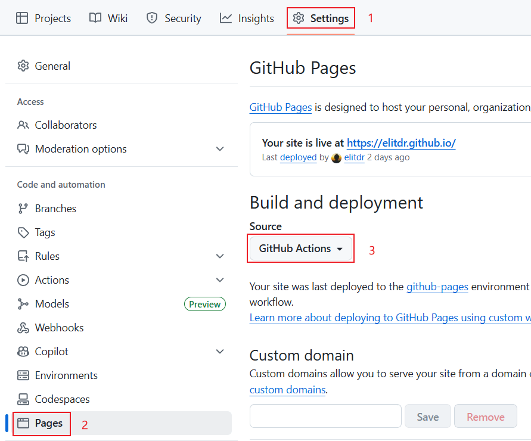

# 创建属于你的个人主页

本项目基于 VitePress 构建，发布至 GitHub Pages，仅适合开发者或动手能力强的朋友。

## 新建一个 VitePress 项目

因为 VitePress 官方文档有更详细的[安装步骤](https://vitepress.dev/zh/guide/getting-started)，以下内容仅作参考。

### 安装

```sh
npm add -D vitepress
```

### 初始化

```sh
npx vitepress init
```

选择根目录下初始化省略 `docs` 目录，选择定制默认主题方便后续修改，也可自行配置。

```sh {3-4,12-13}
┌  Welcome to VitePress!
│
◇  Where should VitePress initialize the config? # 根目录下初始化
│  ./
│
◇  Site title: # 主页标题
│  My Awesome Project
│
◇  Site description: # 主页描述
│  A VitePress Site
│
◇  Theme: # 定制默认主题
│  Default Theme + Customization
│
◇  Use TypeScript for config and theme files? # 是否使用 TypeScript
│  Yes
│
◇  Add VitePress npm scripts to package.json? # 是否添加 npm 脚本
│  Yes
│
└  Done! Now run npm run docs:dev and start writing.

# 提示:
# 既然你选择自定义主题，你也应该明确将vue安装为开发依赖。
Tips:
- Since you've chosen to customize the theme, you should also explicitly install vue as a dev dependency.
```

### 将 Vue 安装为开发依赖

```sh
npm install vue
```

## 新建一个 GitHub 仓库

设置仓库为**公开**状态，并把项目代码上传至仓库。

### .gitignore

GitHub Actions 会自动构建和部署，不需要上传这些内容。

::: code-group

```[.gitignore]
node_modules
cache
dist
```

:::

### GitHub Pages 设置

依次进入 `Settings` -> `Pages`，将 `Build and deployment - Source` 设置为 `GitHub Actions`，表示 GitHub Pages 通过 GitHub Actions 自动构建和部署。

::: info 截图

:::

## 部署

创建`.github/workflows/deploy.yml`文件，并添加以下配置。

::: code-group

```yaml [.github/workflows/deploy.yml] {9,54}
# 构建 VitePress 站点并将其部署到 GitHub Pages 的示例工作流程
#
name: Deploy VitePress site to Pages

on:
  # 在针对 `main` 分支的推送上运行。如果你
  # 使用 `master` 分支作为默认分支，请将其更改为 `master`
  push:
    branches: [main]

  # 允许你从 Actions 选项卡手动运行此工作流程
  workflow_dispatch:

# 设置 GITHUB_TOKEN 的权限，以允许部署到 GitHub Pages
permissions:
  contents: read
  pages: write
  id-token: write

# 只允许同时进行一次部署，跳过正在运行和最新队列之间的运行队列
# 但是，不要取消正在进行的运行，因为我们希望允许这些生产部署完成
concurrency:
  group: pages
  cancel-in-progress: false

jobs:
  # 构建工作
  build:
    runs-on: ubuntu-latest
    steps:
      - name: Checkout
        uses: actions/checkout@v4
        with:
          fetch-depth: 0 # 如果未启用 lastUpdated，则不需要
      # - uses: pnpm/action-setup@v3 # 如果使用 pnpm，请取消此区域注释
      #   with:
      #     version: 9
      # - uses: oven-sh/setup-bun@v1 # 如果使用 Bun，请取消注释
      - name: Setup Node
        uses: actions/setup-node@v4
        with:
          node-version: 22
          cache: npm # 或 pnpm / yarn
      - name: Setup Pages
        uses: actions/configure-pages@v4
      - name: Install dependencies
        run: npm ci # 或 pnpm install / yarn install / bun install
      - name: Build with VitePress
        run: npm run docs:build # 或 pnpm docs:build / yarn docs:build / bun run docs:build
      - name: Upload artifact
        uses: actions/upload-pages-artifact@v3
        with:
          # 构建输出的目录
          path: .vitepress/dist

  # 部署工作
  deploy:
    environment:
      name: github-pages
      url: ${{ steps.deployment.outputs.page_url }}
    needs: build
    runs-on: ubuntu-latest
    name: Deploy
    steps:
      - name: Deploy to GitHub Pages
        id: deployment
        uses: actions/deploy-pages@v4
```

:::

::: warning 注意
如果按照本文步骤操作可直接复制此配置，重点关注第 9 行和第 54 行，具体请查看[官方文档](https://vitepress.dev/zh/guide/deploy)。
:::
